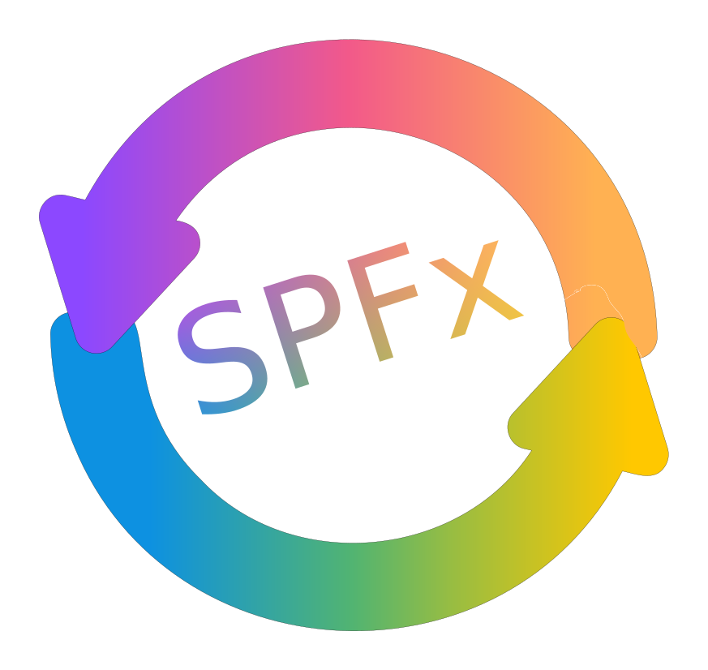

# PnP SPFx Live Reloader

Download the [latest version](https://github.com/pnp/sp-livereload/tree/main/installation)

## Summary

Enables your SharePoint Framework Solutions to automatically refresh the browser window after rebuild.

## FAQ

### How is it different from spfx-fast-serve?

PnP SPFx live reloader supports projects from SPFx (SharePoint Framework) Version 1.0 onwards. After a successful build, SharePoint will automatically reload the updated code using a built-in mechanism.

spfx-fast-serve, on the other hand, requires Microsoft-unsupported manipulation of the SPFx build chain. 

### Are there any additional requirements?

The PnP SPFx Live Reloader is a custom application customiser that can be connected to any SPFx project with **zero configuration effort** for your current and upcoming projects.

### Will this make SharePoint Framework development faster?

Many factors of your system configuration and hardware influence the performance of the SharePoint Framework build chain. To make something faster or slower is always highly subjective.

However, PnP SPFx Live Reloader gives you a smoother development experience by not having to reload the browser manually and look for the SharePoint Framework build chain to complete all its tasks.

You can focus on your code rather than when it is time to reload your browser.

## Used SharePoint Framework Version

## Applies to

- [SharePoint Framework](https://aka.ms/spfx)
- [Microsoft 365 tenant](https://docs.microsoft.com/en-us/sharepoint/dev/spfx/set-up-your-developer-tenant)

## Prerequisites

None so far.

## Solution

| Solution    | Author(s)                                               |
| ----------- | ------------------------------------------------------- |
| PnP SFPx Livereloader | Stefan Bauer - N8D, [Twitter](https://x.com/stfbauer), [LinkedIn](https://www.linkedin.com/in/stfbauer/) |

## Version history

| Version | Date             | Comments        |
| ------- | ---------------- | --------------- |
| 1.0     | July 11, 2024 | Initial release |

## Disclaimer

**THIS CODE IS PROVIDED _AS IS_ WITHOUT WARRANTY OF ANY KIND, EITHER EXPRESS OR IMPLIED, INCLUDING ANY IMPLIED WARRANTIES OF FITNESS FOR A PARTICULAR PURPOSE, MERCHANTABILITY, OR NON-INFRINGEMENT.**

---

## Installation

1. Create a [site collection app catalog](https://learn.microsoft.com/en-us/sharepoint/dev/general-development/site-collection-app-catalog) in your development environment - DO NOT INSTALL GLOABLLY
2. Update 'PnPSPFxLiveReloader.sppkg' to this app site catalog and install
3. You will see the following bar at the bottom of your browser window.

## Minimal Path to Awesome

- Clone this repository
- Ensure that you are at the solution folder
- in the command-line run:
  - **npm install**
  - **gulp serve**

## Features

For now just reload the Browser Window once the browser have been reloaded.

## References

- [Getting started with SharePoint Framework](https://docs.microsoft.com/en-us/sharepoint/dev/spfx/set-up-your-developer-tenant)
- [Building for Microsoft teams](https://docs.microsoft.com/en-us/sharepoint/dev/spfx/build-for-teams-overview)
- [Use Microsoft Graph in your solution](https://docs.microsoft.com/en-us/sharepoint/dev/spfx/web-parts/get-started/using-microsoft-graph-apis)
- [Publish SharePoint Framework applications to the Marketplace](https://docs.microsoft.com/en-us/sharepoint/dev/spfx/publish-to-marketplace-overview)
- [Microsoft 365 Patterns and Practices](https://aka.ms/m365pnp) - Guidance, tooling, samples and open-source controls for your Microsoft 365 development
